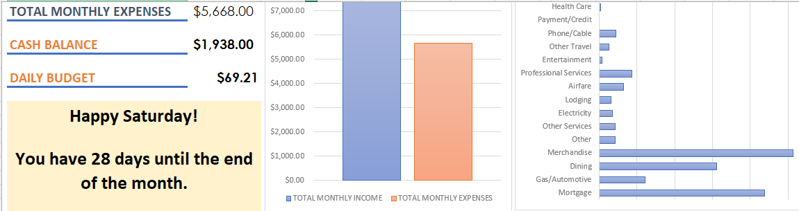
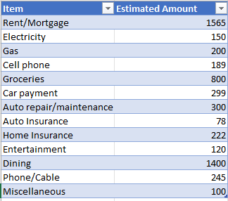

# Budget Planner

This repository contains an advanced Excel-based Budget Planner designed to help users effectively manage their finances. The Budget Planner includes automated calculations, detailed insights, and custom features tailored for personal and household budgeting.

## Features

- **Expense Tracking**: Categorize and log your expenses with ease.
- **Income Management**: Record and monitor multiple income streams.
- **Automated Calculations**: Generate totals, balances, and savings dynamically.
- **Custom Categories**: Add or edit categories to suit your needs.
- **Interactive Dashboard**: Visualize your financial data with charts and summaries.
- **Macros Enabled**: Perform advanced operations with built-in macros.

## Requirements

- **Software**: Microsoft Excel (Version 2016 or later) with macros enabled.
- **System**: Windows or macOS with Excel support.

## Installation

1. Clone this repository to your local machine:
   ```bash
   git clone https://github.com/yourusername/budget-planner.git
   ```

2. Open the `Budget.xlsm` file in Microsoft Excel.

3. Enable macros if prompted to unlock all features.

## Usage

1. **Set Up Your Budget**:
   - Navigate to the `Settings` sheet to configure categories and initial values.

2. **Input Your Data**:
   - Log income and expenses in their respective sheets.

3. **Analyze Your Budget**:
   - Review summaries and charts in the `Dashboard` sheet for insights.

4. **Customize**:
   - Modify formulas, categories, or layouts as needed.

## Screenshots

### Dashboard Overview


### Expense Input


## Contributing

Contributions are welcome! Please follow these steps:

1. Fork the repository.
2. Create a new branch:
   ```bash
   git checkout -b feature-name
   ```
3. Make your changes and commit them:
   ```bash
   git commit -m "Description of changes"
   ```
4. Push to the branch:
   ```bash
   git push origin feature-name
   ```
5. Open a pull request.

## License

This project is licensed under the [MIT License](LICENSE).

## Support

For questions or support, please create an issue or contact [your email].

## Disclaimer

This budget planner is provided as-is. Please verify all calculations and use at your own discretion.
